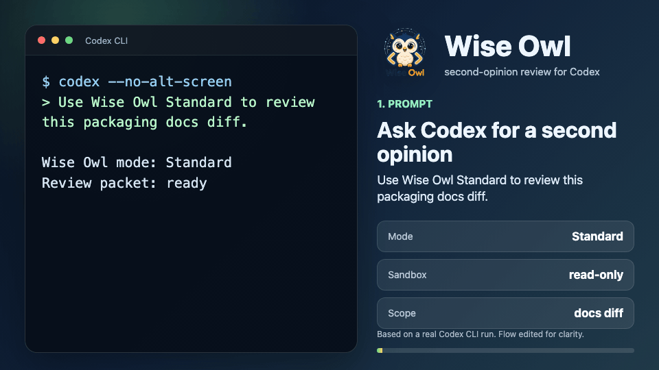

<p align="center">
  
</p>

<h1 align="center">Wise Owl</h1>

<p align="center">
  <strong>A second-opinion review ritual for Codex, ready in one minute.</strong>
</p>

<p align="center">
  <a href="#install-in-60-seconds">Install</a>
  &nbsp;|&nbsp;
  <a href="#watch-it-work">Demo</a>
  &nbsp;|&nbsp;
  <a href="docs/wise-owl.md">Workflow guide</a>
  &nbsp;|&nbsp;
  <a href="docs/packaging.md">Docs</a>
  &nbsp;|&nbsp;
  <a href="LICENSE">MIT</a>
</p>

> Keep the duck for debugging. Bring the owl for the second opinion.

Wise Owl gives Codex a sharper pre-ship moment: ask for a review, let focused read-only reviewers inspect the plan or diff, and get one Prime Owl verdict instead of a pile of loose opinions.

Use it when a change matters enough that "looks fine" is not enough. It is built for the review step most agentic coding workflows need: one more structured pass over correctness, tests, security, and release risk before you trust the change.

<p align="center">
  
</p>

## Install In 60 Seconds

```bash
git clone https://github.com/msftnadavbh/wiseowl.git
cd wiseowl

python3 install.py --dry-run
python3 install.py
python3 install.py --check
```

Restart or reopen Codex, then ask:

```text
Use Wise Owl Standard to review this change before I finalize.
```

That is the whole first run. The dry run previews the install, the normal run adds Wise Owl, and the check confirms the complete read-only reviewer setup is in the expected Codex locations. Wise Owl requires Python 3.10+ and uses only the standard library.

<p align="center">
  
</p>

## Why You'll Keep It

- One calm final check before you ship.
- Reviewers with clear jobs: logic, safety, proof, and judgment.
- Prime Owl filters the noise and turns review into an action list.
- Works from normal Codex prompts, no new app to babysit.
- Local-first package: skill files, custom-agent TOMLs, docs, fixtures, and validator support.
- Your setup lives in your Codex environment, without a separate Wise Owl account or dashboard.

## Watch It Work

<p align="center">
  
</p>

Start from a normal Codex prompt. Wise Owl Standard selects reviewers, collects read-only feedback, and returns a Prime Owl verdict with one final action list. The demo is based on a disposable-repo Codex CLI run; the source excerpt is in [docs/demo-transcript.md](docs/demo-transcript.md).

## Pick The Right Review

| Mode | Reviewers | Use It For |
| --- | --- | --- |
| Lite | Prime Owl only | Quick sanity checks, docs, prompts, small plans |
| Standard | Logic Owl + Proof Owl, then Prime Owl | Normal implementation, tests, packaging, installer changes |
| Security | Guardian Owl, then Prime Owl | Auth, privacy, secrets, permissions, sensitive data |
| Full Council | Logic Owl + Guardian Owl + Proof Owl, then Prime Owl | Release gates, public APIs, filesystem/network boundaries, high-risk changes |

Ask in plain language:

```text
Use Wise Owl Lite to sanity-check this README change.
```

```text
Use Wise Owl Full Council for this release gate.
```

## Meet The Owls

- **Logic Owl** checks correctness, contracts, edge cases, and runtime behavior.
- **Guardian Owl** checks security, privacy, permissions, secrets, and unsafe operations.
- **Proof Owl** checks tests, validation, CI confidence, and evidence quality.
- **Prime Owl** judges the critic output, rejects weak findings, ranks real issues, and gives Codex one builder-facing packet.

## What Gets Installed

- `~/.agents/skills/wise-owl`: the Codex skill.
- `~/.codex/agents`: the read-only custom reviewer TOMLs.
- `~/.codex/config.toml`: a safe merge for Codex agent settings.
- `~/.agents/skills/wise-owl/.wise-owl-install.json`: hashes for Wise Owl-owned files, used for safe upgrades and uninstall.

First-time installs should use the dry run and normal install shown above. `--force` exists for intentional overwrites or legacy agent cleanup.

## Keep It Healthy

Check the installation at any time:

```bash
python3 install.py --check
```

Upgrade after pulling a newer release:

```bash
git pull
python3 install.py --dry-run
python3 install.py
python3 install.py --check
```

Wise Owl upgrades files it previously installed only when their hashes still match. Local customizations are preserved and reported instead of overwritten.

Installations created before v0.2.0 have no ownership manifest. Review the dry run and use `--force` once to migrate that older install; later upgrades return to the safe hash-based path.

Uninstall Wise Owl-owned files while leaving shared Codex config and `AGENTS.md` content alone:

```bash
python3 install.py --uninstall
```

## Docs

- [docs/wise-owl.md](docs/wise-owl.md): workflow, modes, schemas, and examples.
- [docs/packaging.md](docs/packaging.md): install, uninstall, plugin skeleton, and release checklist.
- [docs/distribution.md](docs/distribution.md): package contents and archive expectations.
- [docs/release.md](docs/release.md): maintainer validation and release commands.

## License

MIT licensed.
