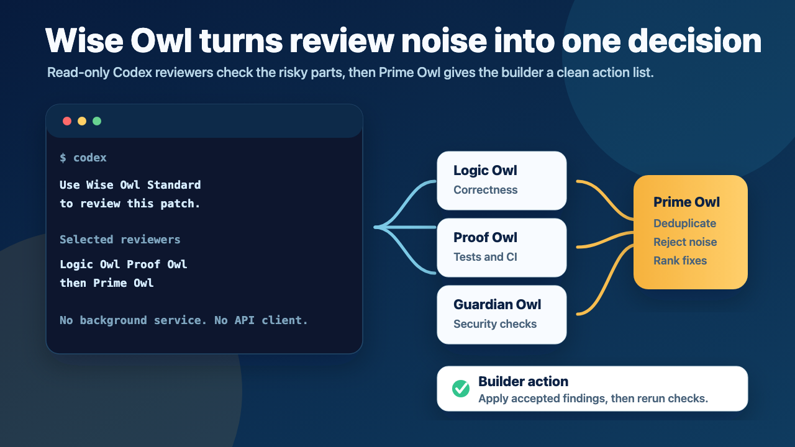
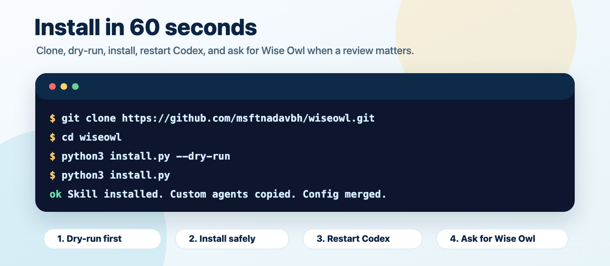

<p align="center">
  
</p>

<h1 align="center">Wise Owl</h1>

<p align="center">
  <strong>Multi-agent second-opinion review workflow for Codex.</strong>
</p>

<p align="center">
  <a href="docs/wise-owl.md">Workflow guide</a>
  &nbsp;|&nbsp;
  <a href="docs/packaging.md">Install docs</a>
  &nbsp;|&nbsp;
  <a href="docs/release.md">Release checks</a>
  &nbsp;|&nbsp;
  <a href="LICENSE">MIT</a>
</p>

Wise Owl gives Codex a calmer review loop: focused read-only reviewers inspect the risky parts, Prime Owl removes noise, and you get one action list before you finalize.

Use it when a change is important enough that "looks fine" is not enough.

<p align="center">
  
</p>

## Why Install It

- Catch wrong assumptions before they ship.
- Separate real findings from style noise.
- Make review output predictable with strict JSON packets.
- Keep Codex in charge of the work while reviewers stay read-only.
- Add a repeatable final-review habit for release gates, security-sensitive edits, installer changes, and tricky bugs.

Wise Owl is a Codex skill + custom-agent workflow. It is not a daemon, hosted service, background hook, runtime framework, custom orchestrator, or direct model API client.

## Install In 60 Seconds

```bash
git clone https://github.com/msftnadavbh/wiseowl.git
cd wiseowl

python3 install.py --dry-run
python3 install.py
```

Then restart or reopen Codex and ask:

```text
Use Wise Owl Standard to review this change before I finalize.
```

<p align="center">
  
</p>

The dry run shows exactly what would change. The install writes the skill to `~/.agents/skills/wise-owl`, custom agents to `~/.codex/agents`, and config to `~/.codex/config.toml`.

Use `--force` only after reviewing target paths and intentionally overwriting or migrating legacy Wise Owl files. It is not the default first-time install path.

Prefer the explicit installer path? It is the same behavior:

```bash
python3 .agents/skills/wise-owl/scripts/wise_owl_install.py --scope user --dry-run
python3 .agents/skills/wise-owl/scripts/wise_owl_install.py --scope user
```

## How It Feels In Codex

Ask for a mode in plain language:

```text
Use Wise Owl Lite to sanity-check this README change.
```

```text
Use Wise Owl Standard to review the final diff and tests.
```

```text
Use Wise Owl Full Council for this release gate.
```

Codex gathers a compact review packet, selected read-only reviewers return JSON, and Prime Owl gives the builder one verdict:

- `pass`: no accepted findings remain.
- `caution`: accepted findings exist, but none are blocking.
- `fix_required`: at least one accepted finding is blocking.

## Modes

| Mode | Reviewers | Best For |
| --- | --- | --- |
| Lite | Prime Owl only | Docs, prompts, small plans, quick sanity checks |
| Standard | Logic Owl + Proof Owl, then Prime Owl | Normal implementation, tests, packaging, installer changes |
| Security | Guardian Owl, then Prime Owl | Security, privacy, auth, secrets, sensitive data boundaries |
| Full Council | Logic Owl + Guardian Owl + Proof Owl, then Prime Owl | Release gates, public API contracts, filesystem/network boundaries, high-risk changes |

Parallel critic execution depends on Codex runtime support. Wise Owl provides prompt/runtime guidance, agent TOMLs, schemas, docs, fixtures, and validator scripts.

## Roles

- **Logic Owl** (`logic_owl`): correctness, contracts, edge cases, runtime behavior.
- **Guardian Owl** (`guardian_owl`): security, privacy, permissions, secrets, unsafe operations.
- **Proof Owl** (`proof_owl`): tests, validation, CI confidence, false-positive checks.
- **Prime Owl** (`prime_owl`): judge that deduplicates, rejects noise, ranks severity, and produces one review packet.

## Validate Packets

```bash
python3 .agents/skills/wise-owl/scripts/wise_owl_validate_packet.py \
  --type critic \
  --file tests/fixtures/critic_valid_logic_pass.json

python3 .agents/skills/wise-owl/scripts/wise_owl_validate_packet.py \
  --type prime \
  --file tests/fixtures/prime_valid_pass_empty.json

python3 .agents/skills/wise-owl/scripts/wise_owl_validate_packet.py \
  --type prime \
  --file tests/fixtures/prime_valid_current_fix_required_api_auth_and_storage.json \
  --critics tests/fixtures/critic_current_guardian_owl_api_auth_and_storage.json \
            tests/fixtures/critic_current_proof_owl_persistence_and_routes.json
```

Without `--critics`, Prime Owl validation is syntax/schema-only and source accounting is not checked.

## Packaging Checks

```bash
PYTHONDONTWRITEBYTECODE=1 python3 -m unittest discover -s tests
python3 -m py_compile \
  install.py \
  .agents/skills/wise-owl/scripts/wise_owl_validate_packet.py \
  .agents/skills/wise-owl/scripts/wise_owl_install.py \
  wise-owl-plugin/scripts/install_wise_owl.py \
  scripts/verify_release.py \
  scripts/build_release_archive.py
python3 scripts/verify_release.py
python3 scripts/build_release_archive.py
```

The release archive is generated locally under `dist/` and should generally not be committed.

The plugin skeleton under `wise-owl-plugin/` packages the skill and plugin assets. Custom-agent TOMLs still need to be copied into Codex-discovered locations by the installer unless future Codex plugin docs add first-class custom-agent registration.

## Known Limitations

- Model names are configurable and depend on models available in the local Codex environment.
- Model diversity depends on available Codex models.
- Parallel execution depends on Codex runtime support.
- Read-only reviewer instructions complement, but do not replace, runtime sandbox and approval policy.
- Plugin custom-agent TOMLs may still need installer copy into Codex-discovered locations.

## Docs

- [docs/wise-owl.md](docs/wise-owl.md): workflow, modes, schemas, and limitations.
- [docs/packaging.md](docs/packaging.md): install, uninstall, plugin skeleton, and release checklist.
- [docs/distribution.md](docs/distribution.md): package contents and archive expectations.
- [docs/release.md](docs/release.md): v0.1.0 release validation.

## License

MIT. The MIT license decision is recorded in [docs/LICENSE_DECISION.md](docs/LICENSE_DECISION.md).
